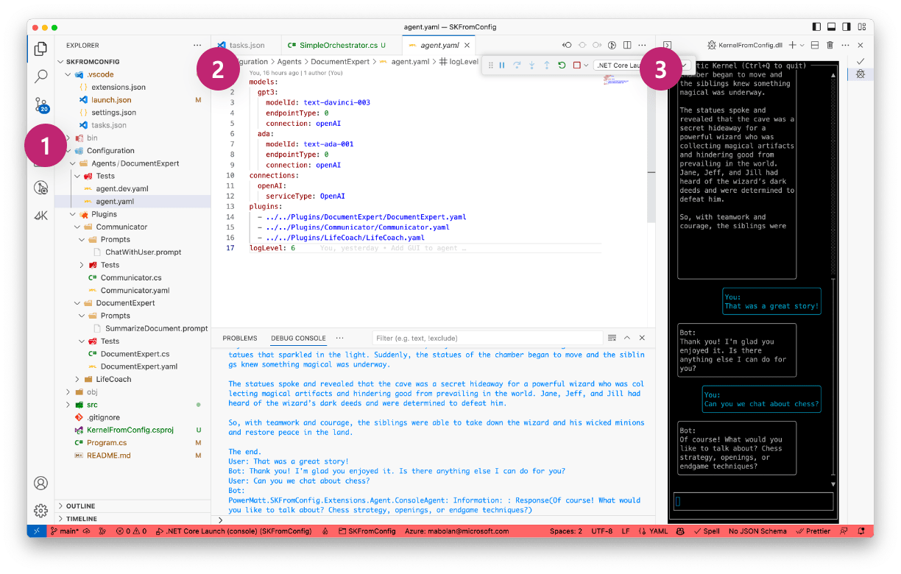

# Semantic Kernel From Config

This project demonstrates some proposed feature enhancements to Semantic Kernel to improve the development experience of using it.

## Features



This repo highlights three main additional features to Semantic Kernel:
1. Provides an opinionated folder structure to organize configuration files Semantic Kernel and its plugins. The folder structure notably adds a section for tests so users can author semantic tests for their agents and plugins.
2. Provides an initial draft proposal of each configuration file. Pictured above is the _agent.yaml_ file which describes the top level configuration for Semantic Kernel. There are also yaml files for each custom plugin.
3. Provides an chat GUI within the terminal for users to interact with their agents. This GUI is powered by the [Terminal.Gui](https://github.com/gui-cs/Terminal.Gui) library and makes it easier and faster to quickly test and debug agents along side the debug console.

## Prerequisites

- [.NET 6](https://dotnet.microsoft.com/download/dotnet/6.0) is required to run this starter.
- Install the recommended extensions
  - [C#](https://marketplace.visualstudio.com/items?itemName=ms-dotnettools.csharp)
  - [Semantic Kernel Tools](https://marketplace.visualstudio.com/items?itemName=ms-semantic-kernel.semantic-kernel)

## Configuring the project

To configure the project, copy the [agent.dev.yaml.example](./Configuration/Agents/ChatAgent/agent.dev.yaml.example) file to _./Configuration/Agents/DocumentExpert/agent.dev.yaml_ and edit the file to add your OpenAI endpoint configuration.

## Running the project

To run the console application just hit `F5` in VS Code.

To build and run the console application from the terminal use the following commands:

```powershell
dotnet build
dotnet run
```
